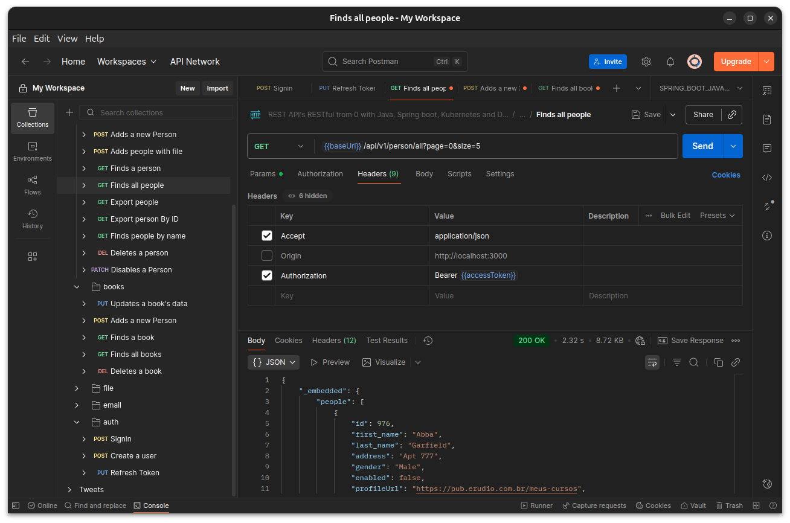
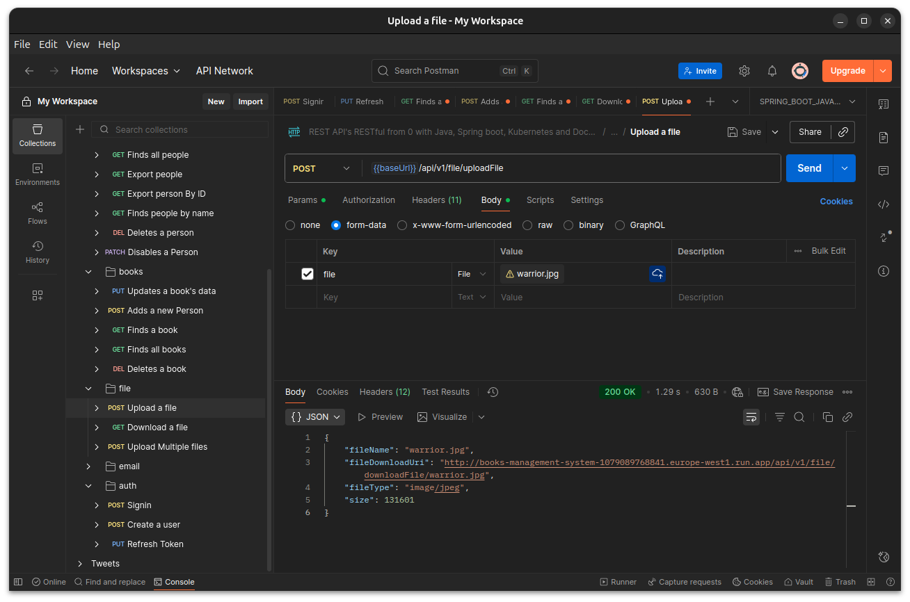
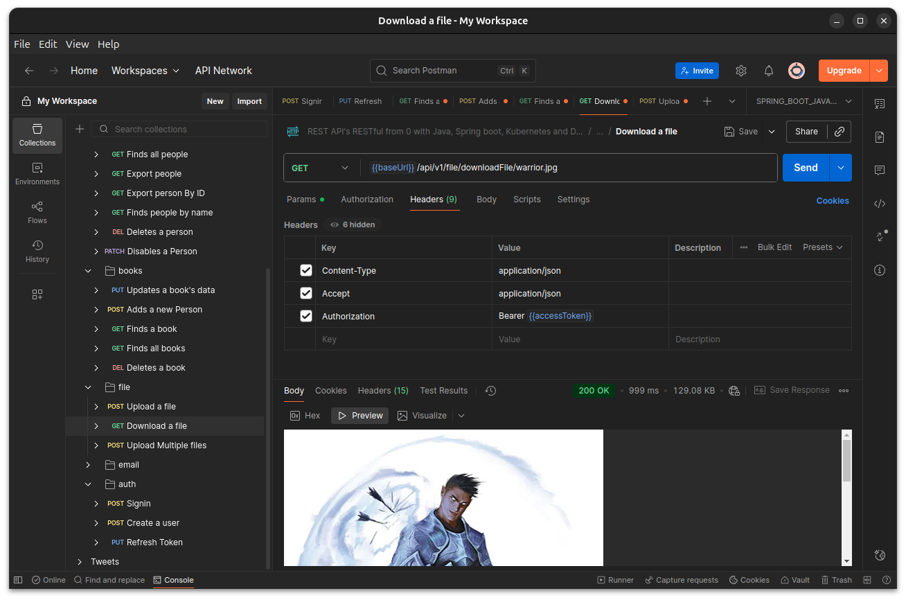
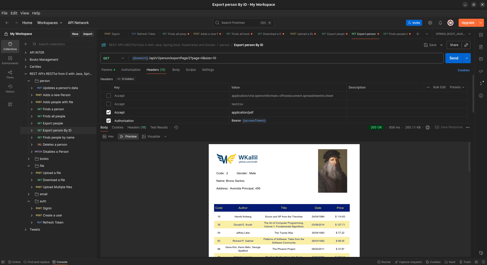
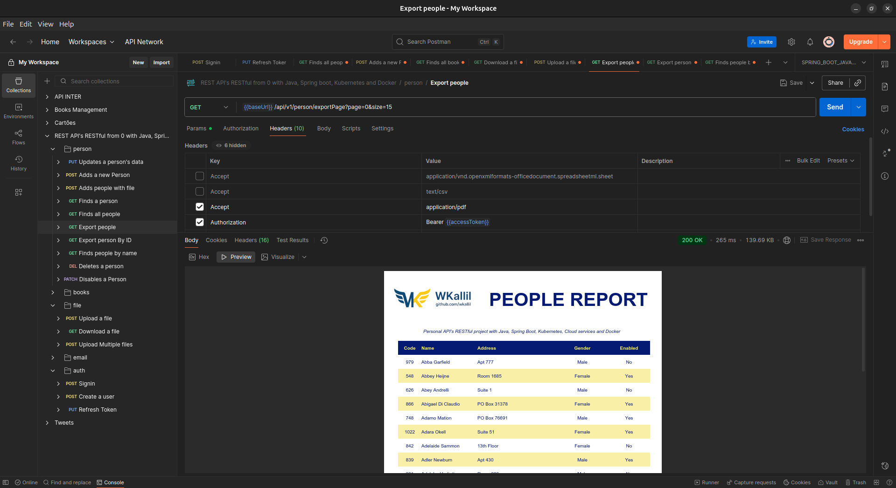
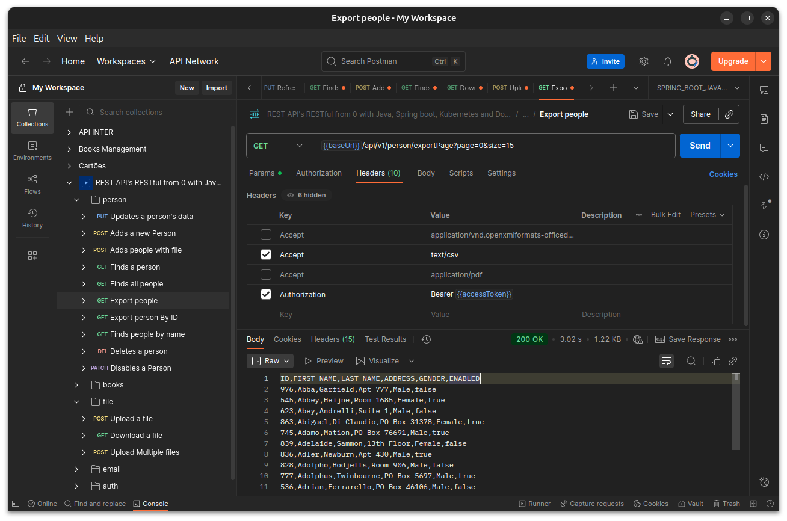

<div>

# 🇺🇸 English Version 🇬🇧

</div>

# Books Management System

[](https://github.com/wkallil/books-management-system/actions/workflows/continuous-deployment.yml)
[](https://hub.docker.com/repository/docker/wkallil/books-management-system)

A robust RESTful API for managing books and users, built with modern Java technologies and best practices in software development.

## 🚀 Technologies & Techniques

### Development
- **Java 21** - Latest version with cutting-edge features
- **Spring Boot 3** - For building production-ready applications
- **Spring Security** - Authentication and authorization
- **Spring Data JPA** - Database operations with Hibernate
- **MapStruct** - Efficient object mapping
- **MySQL** - Primary database
- **Flyway** - Database migration tool

### Testing & Documentation
- **JUnit 5** - Unit and integration testing
- **Mockito** - Mocking framework for tests
- **Swagger/OpenAPI** - API documentation
- **Postman** - API testing and documentation

### DevOps & Infrastructure
- **Docker & Docker Compose** - Containerization
- **Kubernetes** - Container orchestration
- **GitHub Actions** - CI/CD pipeline
- **Maven** - Dependency management and build tool

### Development Tools
- **DBeaver** - Database management
- **JasperStudio** - Report design and generation
- **Postman** - API testing and documentation

## 🏗️ Project Structure

The project follows a clean architecture approach with clear separation of concerns:

```
src/
├── main/
│   ├── java/br/com/wkallil/
│   │   ├── config/         # Configuration classes
│   │   │   ├── OpenApiConfig        # Swagger/OpenAPI configuration
│   │   │   ├── SecurityConfig       # Spring Security setup
│   │   │   ├── WebConfig            # CORS and Web configurations
│   │   │   └── FileStorageConfig    # File upload configuration
│   │   ├── controllers/    # REST endpoints
│   │   │   ├── AuthController       # Authentication endpoints
│   │   │   ├── BookController       # Book management
│   │   │   ├── FileController       # File upload/download
│   │   │   └── PersonController     # User management
│   │   ├── data/          # Data transfer objects (DTOs)
│   │   │   ├── security/           # Authentication/Authorization DTOs
│   │   │   ├── BookVO              # Book value objects
│   │   │   └── PersonVO            # Person value objects
│   │   ├── exceptions/     # Custom exceptions and handlers
│   │   ├── mapper/        # MapStruct object mappers
│   │   ├── model/         # Domain entities
│   │   ├── repositories/  # Data access layer
│   │   ├── security/      # JWT and authentication
│   │   │   ├── jwt/               # JWT token management
│   │   │   └── permissions/       # Role-based access control
│   │   ├── serialization/ # Custom serializers
│   │   │   ├── converter/         # YAML/XML converters
│   │   │   └── YamlJacksonMapper  # YAML configuration
│   │   ├── services/      # Business logic layer
│   │   │   ├── AuthServices       # Authentication logic
│   │   │   ├── BookServices       # Book operations
│   │   │   ├── FileStorageService # File management
│   │   │   └── PersonServices     # User operations
│   │   └── reports/       # JasperReports templates
│   └── resources/
│       ├── db/migration/  # Flyway migrations
│       ├── templates/     # Email templates
│       └── application.yml
└── test/
    └── java/             # Test classes
        └── br/com/wkallil/
            ├── integrationtests/    # Integration tests
            │   ├── controllers/     # Controller tests
            │   │   ├── withxml/     # XML format tests
            │   │   ├── withjson/    # JSON format tests
            │   │   └── withyaml/    # YAML format tests
            │   └── swagger/         # API documentation tests
            ├── unittests/           # Unit tests
            └── configs/             # Test configurations
```

### Key Components

#### Security
- JWT-based authentication
- Role-based access control (ADMIN, USER)
- Password encryption
- Token refresh mechanism

#### Serialization Support
- JSON (default)
- XML
- YAML
- Content negotiation

#### File Management
- File upload/download support
- Secure file storage
- File type validation

#### Email System
- Template-based emails
- HTML email support
- Attachment handling

#### Reporting
- JasperReports integration
- PDF report generation
- Dynamic report parameters

## 📸 API Documentation Screenshots

### People Management


### File Operations



### Reports Generation




## 🧪 Testing

The application includes comprehensive test coverage:

- **Unit Tests**: Testing individual components in isolation
- **Integration Tests**: Testing component interactions
- **Repository Tests**: Database operation testing
- **Controller Tests**: REST endpoint testing with different formats (JSON, XML, YAML)
- **Security Tests**: Authentication and authorization testing

## 🔄 CI/CD Pipeline

The project uses GitHub Actions for continuous integration and deployment:

1. **Build**: Compiles the code and runs tests
2. **Test**: Executes all test suites
3. **Package**: Creates Docker image
4. **Deploy**: Pushes to Docker Hub and deploys to Google Cloud or AWS

## 🐳 Docker Usage

Build and run the application using Docker:

```bash
# Build the image
docker build -t books-management-system .

# Run the container
docker compose up -d
```

Docker Compose sets up:
- Application container
- MySQL database
- Required networking

## ☸️ Kubernetes Deployment

The application is deployed to Kubernetes using:

```bash

# Scale deployment
kubectl scale deployment books-management-system --replicas=3

# View status
kubectl get pods
kubectl get services
```

## 🚦 API Endpoints

The API is fully documented using OpenAPI/Swagger, providing a comprehensive and interactive documentation interface.

### Swagger Documentation

Access the Swagger UI at: `http://localhost:8500/swagger-ui.html`

Features:
- **Interactive Documentation**: Test API endpoints directly from the browser
- **Request/Response Examples**: Clear examples for all endpoints
- **Authentication Support**: Built-in JWT token support
- **Schema Definitions**: Detailed data models and DTOs
- **Error Responses**: Documented error cases and status codes

### Available Endpoints

#### Authentication
- `POST /auth/signin` - User authentication
- `POST /auth/refresh` - Refresh JWT token

#### Books
- `GET /api/v1/books` - List all books
- `GET /api/v1/books/{id}` - Get book by ID
- `POST /api/v1/books` - Create new book
- `PUT /api/v1/books/{id}` - Update book
- `DELETE /api/v1/books/{id}` - Delete book
- `GET /api/v1/books/reports/{id}` - Generate book report

#### Users (People)
- `GET /api/v1/person` - List all users
- `GET /api/v1/person/{id}` - Get user by ID
- `POST /api/v1/person` - Create new user
- `PUT /api/v1/person/{id}` - Update user
- `PATCH /api/v1/person/{id}` - Disable/enable user
- `DELETE /api/v1/person/{id}` - Delete user

### Content Negotiation

The API supports multiple response formats:
- **JSON** (default): `Accept: application/json`
- **XML**: `Accept: application/xml`
- **YAML**: `Accept: application/x-yaml`

### Authentication

All secured endpoints require a JWT token in the Authorization header:
```
Authorization: Bearer {your-jwt-token}
```

## 🛠️ Getting Started

1. Clone the repository
2. Install dependencies: `mvn install`
3. Run the application: `mvn spring-boot:run`
4. Access Swagger UI: `http://localhost:8500/swagger-ui.html`

---

<div>

# 🇧🇷 Versão em Português do Brasil 🇧🇷

</div>

# Sistema de Gerenciamento de Livros

[](https://github.com/wkallil/books-management-system/actions/workflows/continuous-deployment.yml)
[](https://hub.docker.com/repository/docker/wkallil/books-management-system)

Uma API RESTful robusta para gerenciamento de livros e usuários, construída com tecnologias Java modernas e as melhores práticas de desenvolvimento de software.

## 🚀 Tecnologias e Técnicas

### Desenvolvimento
- **Java 21** - Versão mais recente com recursos de ponta
- **Spring Boot 3** - Para construção de aplicações prontas para produção
- **Spring Security** - Autenticação e autorização
- **Spring Data JPA** - Operações de banco de dados com Hibernate
- **MapStruct** - Mapeamento eficiente de objetos
- **MySQL** - Banco de dados principal
- **Flyway** - Ferramenta de migração de banco de dados

### Testes e Documentação
- **JUnit 5** - Testes unitários e de integração
- **Mockito** - Framework para mock em testes
- **Swagger/OpenAPI** - Documentação da API
- **Postman** - Testes e documentação da API

### DevOps e Infraestrutura
- **Docker & Docker Compose** - Containerização
- **Kubernetes** - Orquestração de containers
- **GitHub Actions** - Pipeline de CI/CD
- **Maven** - Gerenciamento de dependências e build

### Ferramentas de Desenvolvimento
- **DBeaver** - Gerenciamento de banco de dados
- **JasperStudio** - Design e geração de relatórios
- **Postman** - Testes e documentação de API

## 🏗️ Estrutura do Projeto

O projeto segue uma arquitetura limpa com clara separação de responsabilidades:

```
src/
├── main/
│   ├── java/br/com/wkallil/
│   │   ├── config/         # Classes de configuração
│   │   │   ├── OpenApiConfig        # Configuração Swagger/OpenAPI
│   │   │   ├── SecurityConfig       # Configuração Spring Security
│   │   │   ├── WebConfig            # Configurações CORS e Web
│   │   │   └── FileStorageConfig    # Configuração upload de arquivos
│   │   ├── controllers/    # Endpoints REST
│   │   │   ├── AuthController       # Endpoints de autenticação
│   │   │   ├── BookController       # Gerenciamento de livros
│   │   │   ├── FileController       # Upload/download de arquivos
│   │   │   └── PersonController     # Gerenciamento de usuários
│   │   ├── data/          # Objetos de Transferência de Dados (DTOs)
│   │   │   ├── security/           # DTOs de autenticação/autorização
│   │   │   ├── BookVO              # Objetos de valor de livros
│   │   │   └── PersonVO            # Objetos de valor de pessoas
│   │   ├── exceptions/     # Exceções personalizadas
│   │   ├── mapper/        # Mapeadores MapStruct
│   │   ├── model/         # Entidades de domínio
│   │   ├── repositories/  # Camada de acesso a dados
│   │   ├── security/      # Autenticação JWT
│   │   │   ├── jwt/               # Gerenciamento de tokens JWT
│   │   │   └── permissions/       # Controle de acesso baseado em papéis
│   │   ├── serialization/ # Serializadores personalizados
│   │   │   ├── converter/         # Conversores YAML/XML
│   │   │   └── YamlJacksonMapper  # Configuração YAML
│   │   ├── services/      # Camada de lógica de negócios
│   │   │   ├── AuthServices       # Lógica de autenticação
│   │   │   ├── BookServices       # Operações com livros
│   │   │   ├── FileStorageService # Gerenciamento de arquivos
│   │   │   └── PersonServices     # Operações com usuários
│   │   └── reports/       # Templates JasperReports
│   └── resources/
│       ├── db/migration/  # Migrações Flyway
│       ├── templates/     # Templates de email
│       └── application.yml
└── test/
    └── java/             # Classes de teste
```

### Componentes Principais

#### Segurança
- Autenticação baseada em JWT
- Controle de acesso baseado em papéis (ADMIN, USER)
- Criptografia de senha
- Mecanismo de atualização de token

#### Suporte à Serialização
- JSON (padrão)
- XML
- YAML
- Negociação de conteúdo

#### Gerenciamento de Arquivos
- Suporte a upload/download de arquivos
- Armazenamento seguro de arquivos
- Validação de tipos de arquivo

#### Sistema de Email
- Emails baseados em templates
- Suporte a email HTML
- Manipulação de anexos

#### Relatórios
- Integração com JasperReports
- Geração de relatórios PDF
- Parâmetros dinâmicos para relatórios

## 📸 Screenshots da Documentação da API

### Gerenciamento de Pessoas


### Operações com Arquivos


### Geração de Relatórios


## 🧪 Testes

A aplicação inclui cobertura abrangente de testes:

- **Testes Unitários**: Testando componentes individualmente
- **Testes de Integração**: Testando interações entre componentes
- **Testes de Repositório**: Testando operações de banco de dados
- **Testes de Controller**: Testando endpoints REST com diferentes formatos (JSON, XML, YAML)
- **Testes de Segurança**: Testando autenticação e autorização

## 🔄 Pipeline CI/CD

O projeto utiliza GitHub Actions para integração e entrega contínua:

1. **Build**: Compila o código e executa testes
2. **Teste**: Executa todas as suítes de teste
3. **Pacote**: Cria imagem Docker
4. **Deploy**: Envia para Docker Hub e faz deploy no Google Cloud ou AWS

## 🐳 Uso do Docker

Construa e execute a aplicação usando Docker:

```bash
# Construir a imagem
docker build -t books-management-system .

# Executar o container
docker compose up -d
```

Docker Compose configura:
- Container da aplicação
- Banco de dados MySQL
- Rede necessária

## ☸️ Deploy no Kubernetes

A aplicação é implantada no Kubernetes usando:

```bash
# Escalar deployment
kubectl scale deployment books-management-system --replicas=3

# Visualizar status
kubectl get pods
kubectl get services
```

## 🚦 Endpoints da API

A API é completamente documentada usando OpenAPI/Swagger, fornecendo uma interface de documentação interativa e abrangente.

### Documentação Swagger

Acesse a UI do Swagger em: `http://localhost:8500/swagger-ui.html`

Recursos:
- **Documentação Interativa**: Teste endpoints diretamente do navegador
- **Exemplos de Requisição/Resposta**: Exemplos claros para todos os endpoints
- **Suporte à Autenticação**: Suporte integrado a token JWT
- **Definições de Schema**: Modelos de dados e DTOs detalhados
- **Respostas de Erro**: Casos de erro e códigos de status documentados

### Endpoints Disponíveis

#### Autenticação
- `POST /auth/signin` - Autenticação de usuário
- `POST /auth/refresh` - Atualização de token JWT

#### Livros
- `GET /api/v1/books` - Listar todos os livros
- `GET /api/v1/books/{id}` - Obter livro por ID
- `POST /api/v1/books` - Criar novo livro
- `PUT /api/v1/books/{id}` - Atualizar livro
- `DELETE /api/v1/books/{id}` - Excluir livro
- `GET /api/v1/books/reports/{id}` - Gerar relatório do livro

#### Usuários (Pessoas)
- `GET /api/v1/person` - Listar todos os usuários
- `GET /api/v1/person/{id}` - Obter usuário por ID
- `POST /api/v1/person` - Criar novo usuário
- `PUT /api/v1/person/{id}` - Atualizar usuário
- `PATCH /api/v1/person/{id}` - Desabilitar/habilitar usuário
- `DELETE /api/v1/person/{id}` - Excluir usuário

### Negociação de Conteúdo

A API suporta múltiplos formatos de resposta:
- **JSON** (padrão): `Accept: application/json`
- **XML**: `Accept: application/xml`
- **YAML**: `Accept: application/x-yaml`

### Autenticação

Todos os endpoints seguros requerem um token JWT no cabeçalho Authorization:
```
Authorization: Bearer {seu-token-jwt}
```

## 🛠️ Começando

1. Clone o repositório
2. Instale as dependências: `mvn install`
3. Execute a aplicação: `mvn spring-boot:run`
4. Acesse o Swagger UI: `http://localhost:8500/swagger-ui.html`

